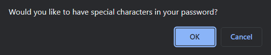
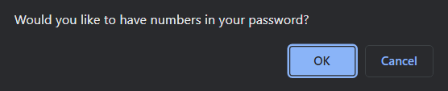
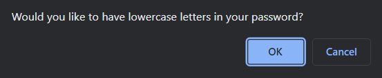

# Module 3 Password Generator

## Description

This project is a password generator that will produce a randomly generated password depending on the user inputs. The project consists of an index and css file for the front end of the project and javascript for the functions and code that help generate the password. The password generator is useful for highspeed generation of passwords that need to meet certain criteria. During this project I learned the importance of certain javascript functions that will need to be used again in future projects and why we use them.

## Installation

To install this application download the file in the Github.

## Prerequisites

In order to install this application and edit the code you must have a text editor installed. The one I used for this project was Studio Visual Code.

## Usage

To use the password generator, head to the link provided and make sure that pop-ups are allowed on your browser. Once that is confirmed then all you have to do is to click the button and answer the prompts accordingly and it will produce a random password in the "Your Secure Password" box. Screenshots and links will be included below.

## Links
[GitHub-Repo](https://github.com/charles-ram/m3-password-generator)
[Active-Site](https://charles-ram.github.io/m3-password-generator/)